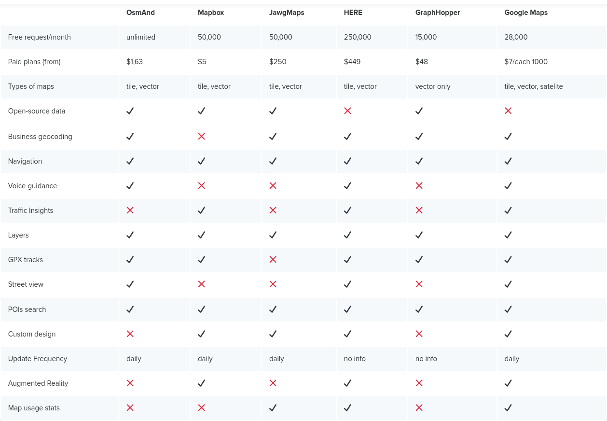

# Documentation

## SQL

[JDBC Postgres](https://jdbc.postgresql.org/documentation)

## Local

[DOC Oracle Cloud Tutorial](./DOC_Oracle_Cloud.md)

[DOC SQL Queries](./DOC_SQL.md)

[DOC Docker](./DOC_Docker.md)

[DOC Archive code](./DOC_Code_Archive.md)

# Login:

Expectation:

# Maps:

https://elfsight.com/blog/2020/02/best-alternatives-to-google-maps-api/

https://developers.google.com/maps/documentation/javascript/cloud-setup#console_1
